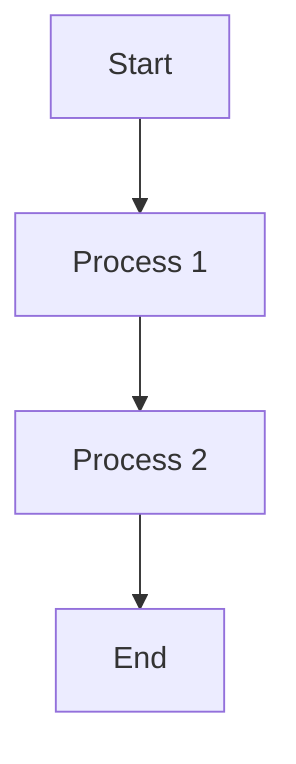
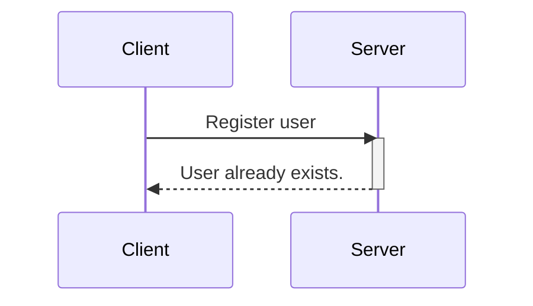

Stack-edit is online editor

<ul> hello
hi
<ul> how 
<ul> are

flowchart
flowchart: This keyword tells that we are creating a flowchart.
TD: this is the orientation of the flowchart and stands for Top to Down. The other FlowChart orientations are:
– TB - Top to bottom,same as TD.
– BT - Bottom to top
– RL - Right to left
– LR - Left to right
-->: The direction of the arrow connecting the nodes.

sequenceDiagram: This keyword specifies that we are making a sequence diagram.
participant: These are the participants or the actors in a sequence diagram.
activate/ deactivate: It is possible to activate and deactivate an actor. Activation shows as a small rectangle between interactions.
-->>: Connecting lines (dashed).
->: Connecting lines (solid).
